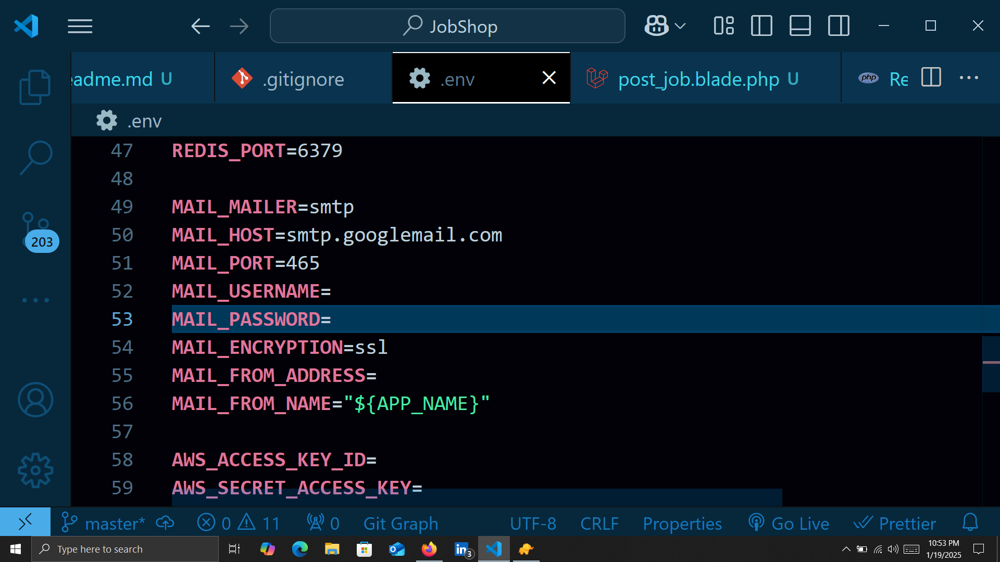
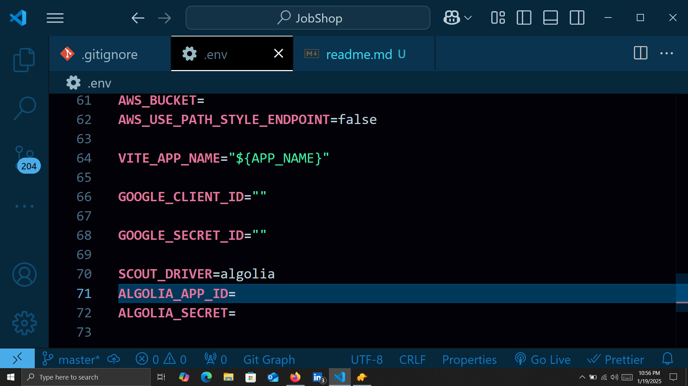

           JobShop Application
## Intro
This job portal connects job seekers, especially recent graduates, with employers in the technology sector. Built with Laravel, MySQL, and Tailwind CSS, it offers features like job listings, application tracking, a CV-builder, and an employer dashboard to search for candidates. The platform supports multi-role users, Google OAuth login, and prioritizes security with email verification and password reset.

## Guidelines:
- **Login as company**: abbasi151@gmail.com / 12345
- **Login as jobseeker**: Tom@gmail.com / 1234
- **Login as admin**: Nansy123@gmail.com / 123

.if email verification not working try to put your email and genrate app password. here is link how (https://youtu.be/lSURGX0JHbA?si=Joszuqr_OPa7xdyv)

## Technologies
- **Backend**: Laravel
- **Frontend**: HTML, CSS, JavaScript, Tailwind CSS
- **Database**: MySQL
- **Other**: 
1.scroll js (for animation)
2.sweet alert for  (for popups)
3.choices.js for  (for selecting multiple options and design it)
4.ckeditor for  (for rich editior in forms text area)

## Screenshots

#Remaing images are in screenshots folder

## Remember to fill this section

![for the searching it uses algolia search so include its api key
and 
also include google client id and google secret id in env for login with google purpose thats genrated when you create google app 
]

## Acknowledgments
- Thanks to [Tailwind CSS](https://tailwindcss.com) for providing an amazing utility-first CSS framework.

